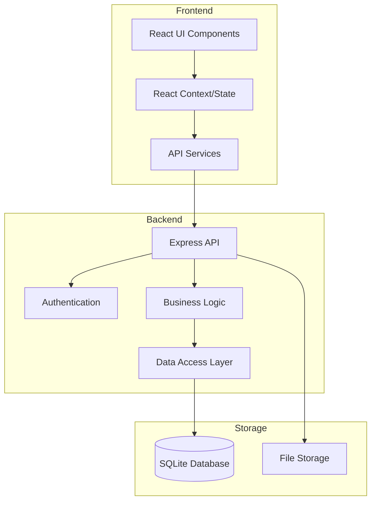
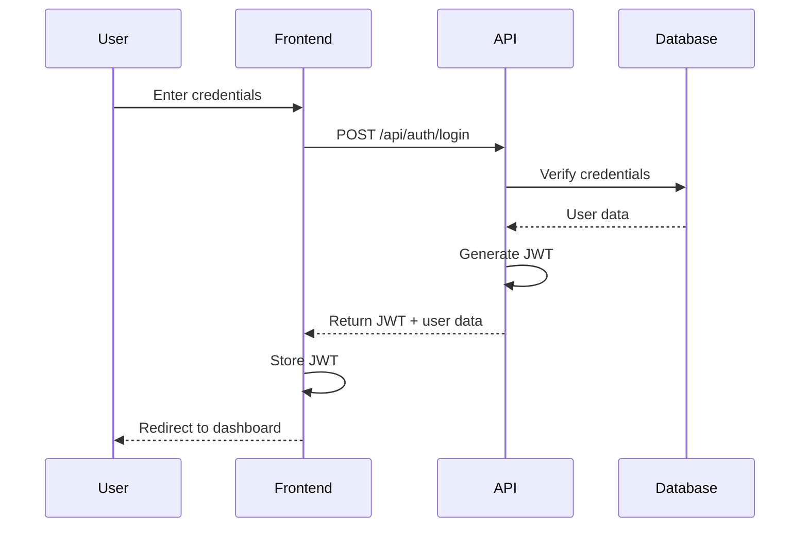
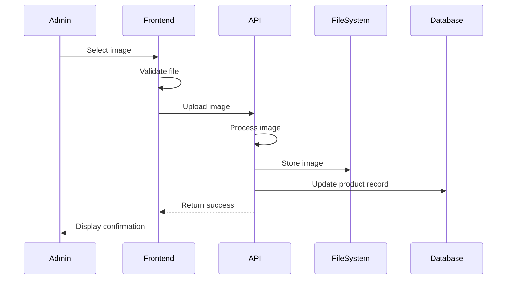

V# Design Document

## Overview

This design document outlines the architecture and implementation details for enhancing the shopping website with authentication, product management capabilities, and improved code quality. The enhancements will build upon the existing React frontend and Express backend architecture while introducing new components and services to support the additional functionality.

## Architecture

The application will follow a layered architecture with clear separation of concerns:

1. **Presentation Layer**: React components for UI rendering
2. **Application Layer**: React context and hooks for state management
3. **Service Layer**: API services for data fetching and business logic
4. **Data Access Layer**: Database interactions and models
5. **Infrastructure Layer**: Authentication, file storage, and cross-cutting concerns

### System Architecture Diagram



## Components and Interfaces

### Authentication Components

1. **AuthContext**: React context for managing authentication state
   - Provides user information and authentication status
   - Handles login, logout, and session management

2. **LoginForm**: Component for user authentication
   - Email and password inputs with validation
   - Error handling and feedback

3. **RegistrationForm**: Component for new user registration
   - User information inputs with validation
   - Role selection (admin only)

4. **ProtectedRoute**: Higher-order component for route protection
   - Redirects unauthenticated users
   - Checks role-based permissions

### Authentication API Endpoints

```
POST /api/auth/login
POST /api/auth/register
POST /api/auth/logout
GET /api/auth/me
```

### Product Management Components

1. **ProductManagementPage**: Main admin interface for product management
   - Product listing with filtering and sorting
   - Actions for add, edit, delete

2. **ProductForm**: Form for adding and editing products
   - Product details inputs
   - Image upload
   - Inventory management

3. **ImageUploader**: Component for handling image uploads
   - File selection
   - Preview
   - Upload progress

### Product Management API Endpoints

```
GET /api/admin/products
POST /api/admin/products
GET /api/admin/products/:id
PUT /api/admin/products/:id
DELETE /api/admin/products/:id
POST /api/admin/products/:id/image
```

## Data Models

### User Model

```javascript
{
  id: INTEGER PRIMARY KEY,
  email: TEXT NOT NULL UNIQUE,
  password: TEXT NOT NULL, // Hashed
  firstName: TEXT,
  lastName: TEXT,
  role: TEXT NOT NULL DEFAULT 'customer', // 'customer' or 'admin'
  createdAt: TIMESTAMP DEFAULT CURRENT_TIMESTAMP,
  updatedAt: TIMESTAMP DEFAULT CURRENT_TIMESTAMP
}
```

### Enhanced Product Model

```javascript
{
  id: INTEGER PRIMARY KEY,
  name: TEXT NOT NULL,
  price: REAL NOT NULL,
  description: TEXT,
  image: TEXT,
  isOnSale: BOOLEAN DEFAULT 0,
  salePrice: REAL,
  regularInventory: INTEGER DEFAULT 0,
  onSaleQuantity: INTEGER DEFAULT 0,
  lowStockThreshold: INTEGER DEFAULT 5,
  createdAt: TIMESTAMP DEFAULT CURRENT_TIMESTAMP,
  updatedAt: TIMESTAMP DEFAULT CURRENT_TIMESTAMP
}
```

## Authentication Flow

### JWT Authentication

The system will use JSON Web Tokens (JWT) for authentication:

1. User submits credentials
2. Server validates credentials and generates JWT
3. JWT is stored in HTTP-only cookie or local storage
4. Subsequent requests include JWT for authentication
5. Server validates JWT signature and expiration



## Image Upload and Storage

### Image Processing Flow

1. Admin selects image file
2. Frontend validates file type and size
3. Image is uploaded to server
4. Server processes image (resizing, optimization)
5. Image is stored in file system
6. Database is updated with image path



## Error Handling

The application will implement a comprehensive error handling strategy:

1. **Frontend Error Handling**:
   - Form validation errors with user feedback
   - API error handling with appropriate UI messages
   - Global error boundary for unexpected errors

2. **Backend Error Handling**:
   - Structured error responses with status codes and messages
   - Validation errors with field-specific details
   - Centralized error middleware

3. **Error Response Format**:
```javascript
{
  status: 400, // HTTP status code
  message: "Validation error", // User-friendly message
  errors: [
    { field: "email", message: "Invalid email format" }
  ]
}
```

## Testing Strategy

### Testing Approach

The application will implement a comprehensive testing strategy to achieve 95% code coverage:

1. **Unit Testing**:
   - Individual component testing
   - Service and utility function testing
   - Reducer and state management testing

2. **Integration Testing**:
   - API endpoint testing
   - Authentication flow testing
   - Database interaction testing

3. **Component Testing**:
   - UI component rendering
   - User interaction simulation
   - State changes verification

4. **End-to-End Testing**:
   - Critical user flows
   - Authentication and authorization
   - Form submission and validation

### Testing Tools

- **Jest**: Test runner and assertion library
- **React Testing Library**: Component testing
- **Supertest**: API testing
- **Mock Service Worker**: API mocking
- **Cypress**: End-to-end testing

## Security Considerations

1. **Password Security**:
   - Bcrypt for password hashing
   - Password strength requirements
   - Rate limiting for login attempts

2. **JWT Security**:
   - Short expiration times
   - Secure, HTTP-only cookies
   - CSRF protection

3. **Input Validation**:
   - Server-side validation for all inputs
   - Sanitization of user-generated content
   - Parameterized queries for database access

4. **File Upload Security**:
   - File type validation
   - Size limitations
   - Virus scanning
   - Separate storage from application files

## Implementation Considerations

1. **Database Migration**:
   - Scripts for adding new tables
   - Data migration for existing products

2. **Backward Compatibility**:
   - Maintain existing API endpoints
   - Ensure existing functionality continues to work

3. **Performance**:
   - Image optimization
   - Pagination for product listings
   - Caching strategies

4. **Accessibility**:
   - ARIA attributes
   - Keyboard navigation
   - Screen reader compatibility