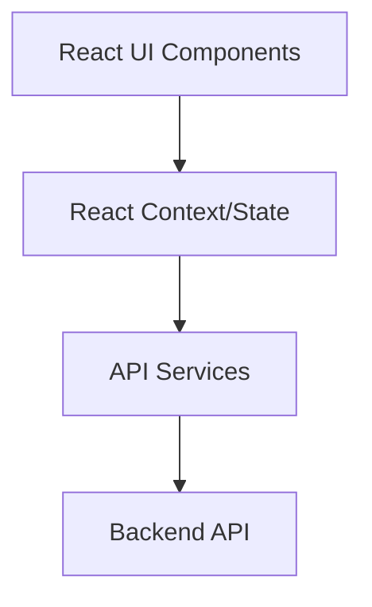
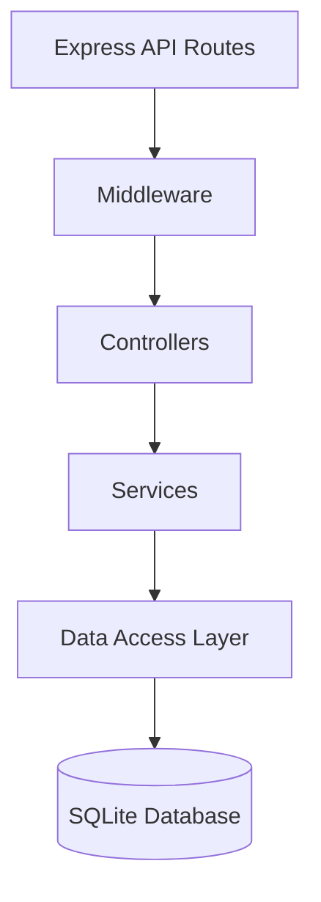
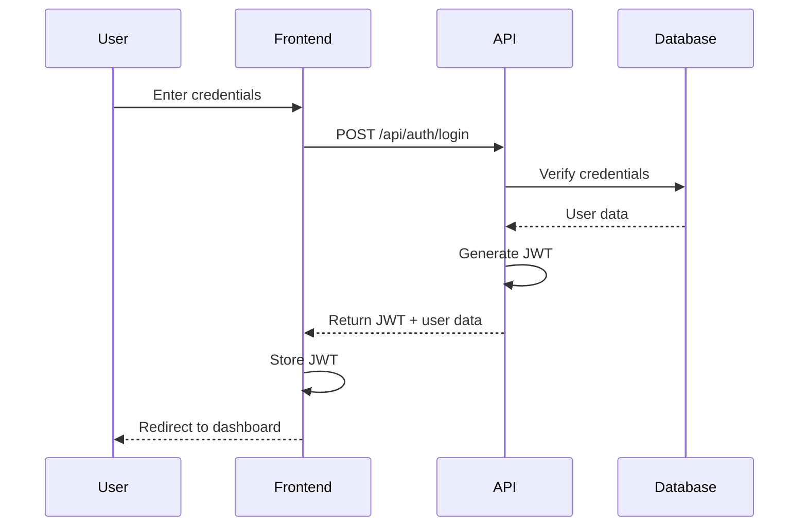

# Development Guide

This document provides detailed information for developers who want to contribute to the Shopping Website project. It covers development setup, coding standards, architecture, testing, and contribution guidelines.

## Table of Contents

1. [Development Environment Setup](#development-environment-setup)
2. [Project Architecture](#project-architecture)
3. [Code Organization](#code-organization)
4. [Coding Standards](#coding-standards)
5. [Authentication System](#authentication-system)
6. [Database Schema](#database-schema)
7. [API Documentation](#api-documentation)
8. [Testing](#testing)
9. [Contribution Guidelines](#contribution-guidelines)
10. [Troubleshooting](#troubleshooting)

## Development Environment Setup

### Prerequisites

- Node.js (v16 or higher)
- npm (v8 or higher)
- Git

### Setup Steps

1. Clone the repository:
   ```bash
   git clone <repository-url>
   cd shopping-website
   ```

2. Install frontend dependencies:
   ```bash
   npm install
   ```

3. Install backend dependencies:
   ```bash
   cd server
   npm install
   cd ..
   ```

4. Initialize the database:
   ```bash
   node server/initDb.js
   ```

5. Start the development servers:
   
   In one terminal (backend):
   ```bash
   node server/server.js
   ```
   
   In another terminal (frontend):
   ```bash
   npm start
   ```

### Environment Variables

The application uses the following environment variables that can be set in a `.env` file:

- `JWT_SECRET`: Secret key for JWT token signing (default: 'your-secret-key-here')
- `PORT`: Backend server port (default: 3001)
- `NODE_ENV`: Environment mode (development, production, test)

## Project Architecture

The application follows a layered architecture with clear separation of concerns:

### Frontend Architecture

1. **Presentation Layer**: React components for UI rendering
2. **Application Layer**: React context and hooks for state management
3. **Service Layer**: API services for data fetching



### Backend Architecture

1. **API Layer**: Express routes and controllers
2. **Service Layer**: Business logic and data processing
3. **Data Access Layer**: Database interactions
4. **Infrastructure Layer**: Authentication, file storage, etc.



## Code Organization

### Frontend Structure

```
src/
├── components/         # Reusable UI components
│   ├── About.jsx       # About page component
│   ├── Cart.jsx        # Shopping cart component
│   ├── Header.jsx      # Header component
│   ├── LoginForm.jsx   # Login form component
│   └── ...
├── context/            # React context providers
│   ├── AuthContext.jsx # Authentication context
│   ├── CartContext.jsx # Shopping cart context
│   └── ...
├── styles/             # Global styles
│   └── main.css        # Main stylesheet
├── App.jsx             # Main application component
└── index.js            # Application entry point
```

### Backend Structure

```
server/
├── middleware/         # Express middleware
│   ├── auth.js         # Authentication middleware
│   └── ...
├── routes/             # API routes
│   ├── auth.js         # Authentication routes
│   ├── products.js     # Product routes
│   └── ...
├── utils/              # Utility functions
│   ├── auth.js         # Authentication utilities
│   └── ...
├── initDb.js           # Database initialization
└── server.js           # Express server
```

## Coding Standards

### JavaScript/React

- Use ES6+ features
- Use functional components with hooks
- Use JSDoc comments for documentation
- Follow the React component structure:
  1. Imports
  2. Component definition
  3. Hooks and state
  4. Helper functions
  5. Effect hooks
  6. Return/render
  7. Export

### CSS

- Use CSS variables for theming
- Follow BEM naming convention
- Organize styles by component

### Naming Conventions

- **Components**: PascalCase (e.g., `ProductCard.jsx`)
- **Files**: camelCase (e.g., `authUtils.js`)
- **CSS Classes**: kebab-case (e.g., `product-card`)
- **Database Tables**: snake_case (e.g., `product_categories`)

## Authentication System

The application uses JWT (JSON Web Token) for authentication. Here's how it works:

1. User submits credentials (email/password)
2. Server validates credentials and generates JWT
3. JWT is stored in localStorage on the client
4. JWT is included in Authorization header for API requests
5. Server middleware validates JWT for protected routes

### Authentication Flow



### Protected Routes

The application uses a `ProtectedRoute` component to secure routes that require authentication:

```jsx
<ProtectedRoute>
  <AdminDashboard />
</ProtectedRoute>
```

For admin-only routes, use the `AdminRoute` component:

```jsx
<AdminRoute>
  <ProductManagement />
</AdminRoute>
```

## Database Schema

### Users Table

```sql
CREATE TABLE users (
  id INTEGER PRIMARY KEY AUTOINCREMENT,
  email TEXT NOT NULL UNIQUE,
  password TEXT NOT NULL,
  firstName TEXT,
  lastName TEXT,
  role TEXT NOT NULL DEFAULT 'customer',
  createdAt TIMESTAMP DEFAULT CURRENT_TIMESTAMP,
  updatedAt TIMESTAMP DEFAULT CURRENT_TIMESTAMP
);
```

### Products Table

```sql
CREATE TABLE products (
  id INTEGER PRIMARY KEY AUTOINCREMENT,
  name TEXT NOT NULL,
  price REAL NOT NULL,
  description TEXT,
  image TEXT,
  isOnSale INTEGER DEFAULT 0,
  salePrice REAL,
  onSaleQuantity INTEGER DEFAULT 0,
  regularInventory INTEGER DEFAULT 0,
  lowStockThreshold INTEGER DEFAULT 5,
  createdAt TIMESTAMP DEFAULT CURRENT_TIMESTAMP,
  updatedAt TIMESTAMP DEFAULT CURRENT_TIMESTAMP
);
```

## API Documentation

### Authentication Endpoints

#### Login

```
POST /api/auth/login
```

Request body:
```json
{
  "email": "user@example.com",
  "password": "password123"
}
```

Response:
```json
{
  "token": "jwt-token-here",
  "user": {
    "id": 1,
    "email": "user@example.com",
    "firstName": "John",
    "lastName": "Doe",
    "role": "customer"
  }
}
```

#### Register

```
POST /api/auth/register
```

Request body:
```json
{
  "email": "newuser@example.com",
  "password": "password123",
  "firstName": "Jane",
  "lastName": "Smith",
  "role": "customer"
}
```

Response:
```json
{
  "token": "jwt-token-here",
  "user": {
    "id": 2,
    "email": "newuser@example.com",
    "firstName": "Jane",
    "lastName": "Smith",
    "role": "customer"
  }
}
```

#### Get Current User

```
GET /api/auth/me
```

Headers:
```
Authorization: Bearer jwt-token-here
```

Response:
```json
{
  "user": {
    "id": 1,
    "email": "user@example.com",
    "firstName": "John",
    "lastName": "Doe",
    "role": "customer"
  }
}
```

### Product Endpoints

#### Get All Products

```
GET /api/products
```

Response:
```json
{
  "products": [
    {
      "id": 1,
      "name": "Premium Coffee Maker",
      "price": 199.99,
      "description": "Automatic drip coffee maker with built-in grinder",
      "image": "/images/products/coffee-maker.jpg",
      "isOnSale": 1,
      "salePrice": 149.99,
      "onSaleQuantity": 5
    },
    // More products...
  ]
}
```

#### Get Product by ID

```
GET /api/products/:id
```

Response:
```json
{
  "product": {
    "id": 1,
    "name": "Premium Coffee Maker",
    "price": 199.99,
    "description": "Automatic drip coffee maker with built-in grinder",
    "image": "/images/products/coffee-maker.jpg",
    "isOnSale": 1,
    "salePrice": 149.99,
    "onSaleQuantity": 5
  }
}
```

## Testing

The project uses Jest and React Testing Library for testing. To run tests:

```bash
npm test
```

### Test Structure

Tests are organized by component or functionality:

```
src/
├── components/
│   ├── __tests__/
│   │   ├── LoginForm.test.jsx
│   │   └── ...
├── context/
│   ├── __tests__/
│   │   ├── AuthContext.test.jsx
│   │   └── ...
```

### Writing Tests

#### Component Tests

```jsx
import { render, screen, fireEvent } from '@testing-library/react';
import LoginForm from '../LoginForm';

test('renders login form with email and password fields', () => {
  render(<LoginForm />);
  expect(screen.getByLabelText(/email/i)).toBeInTheDocument();
  expect(screen.getByLabelText(/password/i)).toBeInTheDocument();
});

test('shows error message on invalid submission', async () => {
  render(<LoginForm />);
  fireEvent.click(screen.getByRole('button', { name: /login/i }));
  expect(await screen.findByText(/email is required/i)).toBeInTheDocument();
});
```

#### API Tests

```javascript
const request = require('supertest');
const app = require('../server');

describe('Authentication API', () => {
  test('should login with valid credentials', async () => {
    const res = await request(app)
      .post('/api/auth/login')
      .send({
        email: 'customer@example.com',
        password: 'customer123'
      });
    expect(res.statusCode).toEqual(200);
    expect(res.body).toHaveProperty('token');
  });
});
```

## Contribution Guidelines

### Workflow

1. Fork the repository
2. Create a feature branch (`git checkout -b feature/amazing-feature`)
3. Make your changes
4. Run tests (`npm test`)
5. Commit your changes (`git commit -m 'Add amazing feature'`)
6. Push to the branch (`git push origin feature/amazing-feature`)
7. Open a Pull Request

### Pull Request Process

1. Ensure all tests pass
2. Update documentation if necessary
3. Add a clear description of the changes
4. Link any related issues
5. Request review from maintainers

### Commit Message Guidelines

Follow the [Conventional Commits](https://www.conventionalcommits.org/) specification:

- `feat`: A new feature
- `fix`: A bug fix
- `docs`: Documentation changes
- `style`: Code style changes (formatting, etc.)
- `refactor`: Code refactoring
- `test`: Adding or updating tests
- `chore`: Maintenance tasks

Example: `feat: add user authentication system`

## Troubleshooting

### Common Issues

#### Database Initialization Fails

If you encounter issues with database initialization:

1. Delete the existing `server/shopping.db` file
2. Run `node server/initDb.js` again
3. Check for error messages in the console

#### JWT Authentication Issues

If you're having problems with authentication:

1. Check that the JWT_SECRET environment variable is set correctly
2. Ensure the token is being included in the Authorization header
3. Verify that the token hasn't expired

#### API Connection Issues

If the frontend can't connect to the backend:

1. Ensure the backend server is running on port 3001
2. Check for CORS issues in the browser console
3. Verify that the API base URL is correct in the frontend code

### Getting Help

If you need help with development:

1. Check the existing documentation
2. Look for similar issues in the issue tracker
3. Ask for help in the project's communication channels
4. Create a new issue with a detailed description of your problem